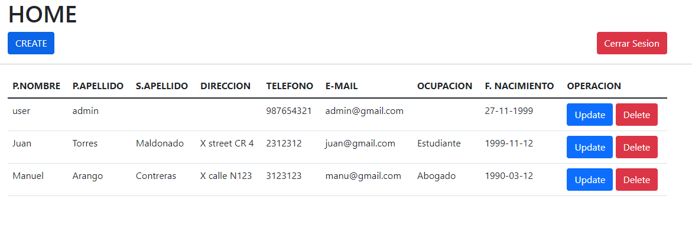

# Prueba Tecnica
Se necesita crear un sistema que permita crear, consultar, modificar y eliminar clientes mediante un aplicativo web
La aplicación cuenta con un rol de administracion.

## Instalacion
``` npm i```
para instalar todas las librerias que se encuentran en el package.json

## Uso
```npm start``` para inciar la aplicacion

El Administrador puede registrar, editar, listar y eliminar a los usuarios


## Construccion
Cada ruta esta potegida por medio de sessiones para cada tipo de usuario soportado por el programa.
los datos de la cuenta adminnistracion vienen por defecto: 
user:admin@gmail.com 
pass:12345

se crea un archivo .env con las variables de entorno que seras clave para proteger los datos

se generan datos de los campos no requeridos vacios por defecto, en caso que al momento de ingresarlos no inserten

Se asigno a las variables de entorno una llamada TOKEN_SECRET, que es iguala a una palabra cualquiera, para asi
generar la cookie donde van a estar las sessiones que protegeran las turas

Para la base de datos se utlizo una variable de entorno denominada MONGODB_URI, la cual almacena 
el valor de URL de la base de datos de mongodb atlas https://studio3t.com/knowledge-base/articles/connect-to-mongodb-atlas/

## Pruebas

Login principal


Dashboard Admin


Create


Update


delete


## Estado del proyecto
En base a los conocimientos que tengo,en el momento (23 mayo de 2022), el software se encuentra en una fase
beta, debido a que hicieron falta algunas validaciones que necesitan realizarse desde el FRONT
